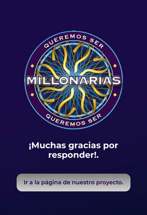

# Voting App.

This is a side project I developed during the last week of Adalab's bootcamp. 

As a team, we decided to recreate the spanish version of the famous game show *Who wants to be a millionaire* for the demo of our project. (It was a very familiar project to all the attendees, so there was no need for an in-depth demonstration of the project and its functionalities).
This app allowed the public to vote for the correct answer to one of the questions during the demo. It collects the votes live and shows them on a dinamic chart that is updated with every vote the database gets.

For the purpose of making it easier to manage during the demo, I designed the app so it displays the voting results on desktop and the voting form on mobile. This means that if you want to test it you would need both a large and a small device to get the full experience.

Once the user has voted, they can visit our project's website.

----

### Technologies

* HTML 5.
* CSS.
* Javascript.
* Node/Express.
* Mongo Atlas.
* AWS - EC2.
* PM2.

----

Copyright (c) 2019 Mariana Lerma.

Permission is hereby granted, free of charge, to any person obtaining a copy
of this software and associated documentation files (the "Software"), to deal
in the Software without restriction, including without limitation the rights
to use, copy, modify, merge, publish, distribute, sublicense, and/or sell
copies of the Software, and to permit persons to whom the Software is
furnished to do so, subject to the following conditions:

The above copyright notice and this permission notice shall be included in all
copies or substantial portions of the Software.

THE SOFTWARE IS PROVIDED "AS IS", WITHOUT WARRANTY OF ANY KIND, EXPRESS OR
IMPLIED, INCLUDING BUT NOT LIMITED TO THE WARRANTIES OF MERCHANTABILITY,
FITNESS FOR A PARTICULAR PURPOSE AND NONINFRINGEMENT. IN NO EVENT SHALL THE
AUTHORS OR COPYRIGHT HOLDERS BE LIABLE FOR ANY CLAIM, DAMAGES OR OTHER
LIABILITY, WHETHER IN AN ACTION OF CONTRACT, TORT OR OTHERWISE, ARISING FROM,
OUT OF OR IN CONNECTION WITH THE SOFTWARE OR THE USE OR OTHER DEALINGS IN THE
SOFTWARE.
